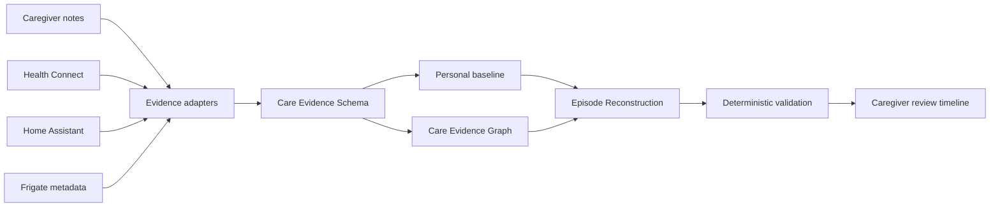

# Care Notes · 照护手记

**Reconstruct what happened when nobody could reliably document it.**

[简体中文](docs/README.zh-CN.md) · [Architecture](docs/ARCHITECTURE.md) · [Product vision](docs/PRODUCT_VISION.md) · [Roadmap](docs/ROADMAP.md) · [Security](SECURITY.md)

Care Notes is an early, open-source, caregiver-first project for reconstructing reviewable episodes from fragmented evidence when the person being cared for cannot or does not reliably self-report.

The moments that matter most are often the moments nobody can document well. A family may only have fragments: a caregiver note, a sleep record, unusual night activity, a door event, a camera event ID, a phone activity window, an offline sensor, or two people remembering the same event differently. Care Notes aims to turn those fragments into a traceable timeline **without pretending uncertainty is certainty**.

> **Current status:** v0.3 is an active development snapshot. It is not clinically validated, not production-ready, and not a diagnosis, treatment, medication-decision or crisis-prediction system.

## Signature idea: Zero-input Episode Reconstruction

“Zero-input” does **not** mean covert surveillance or literally zero human involvement. It means the workflow must not depend on the cared-for person actively filling out a journal during the period that later needs to be reconstructed.

The v0.3 prototype now demonstrates:

- a canonical **Care Evidence Schema** with stable evidence IDs and provenance;
- a fictional seven-day, multi-source household evidence stream;
- personal baseline calculation using transparent median / MAD statistics;
- baseline-deviation detection without diagnostic labels;
- a **Care Evidence Graph** with `same_episode`, `baseline_deviation`, `conflicts_with` and `uncertain_about` relations;
- explicit source gaps such as sensor offline, permission unavailable and not synced;
- conflict preservation when caregivers disagree;
- deterministic claim validation that rejects unsupported evidence IDs and mismatched claim semantics;
- adapter contracts for Health Connect, Home Assistant, Frigate metadata and caregiver observations;
- a bilingual **“What happened?”** web demo with source-clickable evidence.

## Architecture



**Others sense; Care Notes reconstructs.** Integrations provide observations. Care Notes keeps provenance, missingness, conflicts and review state first-class. See [Architecture](docs/ARCHITECTURE.md), [Evidence Schema](docs/EVIDENCE_SCHEMA.md), [Device integrations](docs/DEVICE_INTEGRATIONS.md) and [Privacy model](docs/PRIVACY_MODEL.md).

## What the system must not do

Weak evidence cannot silently become a stronger fact:

| Evidence | Unsupported upgrade |
| --- | --- |
| phone active overnight | insomnia |
| pillbox signal missing | medication not taken |
| kitchen motion absent | did not eat |
| repeated movement | manic episode |
| caregiver says “seemed low” | depression diagnosis |

Every derived claim in the reconstruction prototype must reference real evidence IDs. Unknowns and conflicts remain visible until a person reviews them.

## Run the demos without dependencies

The authored `dist/` files are the web/PWA source. No build step is required.

```sh
python3 -m http.server 8000 --directory dist
```

Then open:

- `http://localhost:8000/episode-demo.html` — v0.3 fictional **“What happened?”** reconstruction demo;
- `http://localhost:8000/` — the earlier local-first caregiving journal workflow.

ES modules need HTTP, not direct file opening. Service workers require HTTPS or localhost and browser support.

## Existing journal workflow

The earlier v0.2 journal remains part of the repository while the reconstruction core is developed. It already supports:

- paragraph capture → draft excerpts → explicit confirmation → save;
- retention of original paragraphs and exact excerpt positions;
- manual linking and side-by-side conflicting accounts;
- selected-record summaries, text export and browser print-to-PDF;
- fictional demos vs personal records;
- backup/restore and correction history;
- Chinese/English UI;
- local rules that work without model calls or fees.

The long-term product direction is **Android app first, web demo/dashboard second, reusable evidence core underneath both**.

## Evidence adapters

`dist/adapters.js` contains the current no-network adapter contract prototypes:

- Health Connect sleep interval → low-level `sleep_duration` evidence;
- Home Assistant state change → household event evidence;
- Frigate review metadata → room-activity evidence without routine raw-video upload;
- caregiver note → human-confirmed observation preserving original wording;
- source status → explicit `sensor_offline`, `permission_unavailable`, `not_synced` or `no_event_observed` state.

These are normalization contracts, not claims that real-device authentication, permissions or production syncing are finished. Real Android Health Connect integration is a later gate.

## AI is optional and constrained

The existing optional server-side OpenAI adapter is separate from the reconstruction engine. It uses server-only credentials and fixed excerpt IDs; the frontend never accepts API keys.

The target architecture is provider-independent / BYOK-friendly. AI may later propose labels, graph links or wording, but deterministic validation and human review remain the authority boundary.

No live-model accuracy claim is made for v0.3. The fictional reconstruction demo requires no paid API.

## Tests and verification

Run:

```sh
npm test
```

The current v0.3 development branch has **49 automated checks passing** in GitHub Actions, covering the earlier journal/provider safeguards plus evidence adapters, personal baseline, source gaps, graph relations, reconstruction, conflict preservation, semantic claim rejection and static mobile/accessibility safeguards.

These tests establish software-contract behavior, not clinical truth or medical accuracy. There is no real-model, clinical, wearable, camera or mobile end-to-end validation claim yet.

## Privacy

Local-first is the default design direction. Routine camera integration is metadata-first: structured Frigate-style events are preferred over continuous cloud video upload. No covert-surveillance feature is intended.

The current browser journal stores records in localStorage without application-layer encryption. The v0.3 episode demo uses fictional data only. Production-oriented Android storage, encryption, permissions and device integrations remain future work. See [Privacy model](docs/PRIVACY_MODEL.md).

## Contributing and maintenance

Maintainer: [Neil-Moonvale](https://github.com/Neil-Moonvale).

Use fictional examples in public bug reports and discussions. See [CONTRIBUTING.md](CONTRIBUTING.md). The project does not claim global novelty, broad adoption or proven health benefit.

Development is intentionally happening through feature branches, pull requests, automated checks and documented release gates. Any future OpenAI open-source support application should use only real implementation, maintenance and adoption evidence—never manufactured stars, users, issues or endorsements.

MIT · Copyright © 2026 Neil-Moonvale. See [LICENSE](LICENSE).
