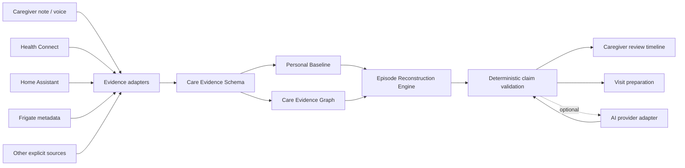
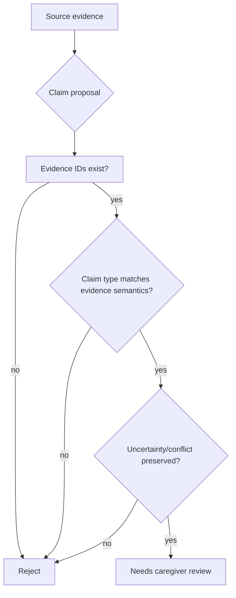

# Care Notes architecture

Care Notes is organized around a reusable evidence/reconstruction core rather than around a chatbot UI.

## System shape



**Others sense; Care Notes reconstructs.** Integrations provide observations. Care Notes is responsible for provenance, uncertainty, baseline comparison, episode grouping and reviewable outputs.

## Core modules

### Evidence adapters

`dist/adapters.js`

Convert source-specific records into low-level canonical evidence. Adapter output must preserve source identity, timestamps, raw references and source gaps. Adapters must not assign diagnosis or intent.

### Care Evidence Schema

`docs/EVIDENCE_SCHEMA.md`

Every observation receives a stable `event_id`, source, observation time, confidence, privacy level and provenance. Derived outputs refer back to these IDs.

### Personal baseline

`dist/evidence.js`

The prototype uses transparent median / MAD statistics over prior evidence for configured metrics. It compares a person with their own recent pattern rather than with a population diagnostic threshold.

### Care Evidence Graph

Graph relations currently include:

- `same_episode`
- `baseline_deviation`
- `conflicts_with`
- `uncertain_about`
- `supports`
- `derived_from`

The graph explains why evidence was grouped or why a claim exists. A graph edge is not medical proof.

### Episode reconstruction

The v0.3 deterministic engine:

1. validates all evidence IDs and provenance;
2. computes personal baseline deviations;
3. finds explicit conflicts between observations about the same claim key;
4. keeps source outages and missingness as explicit unknowns;
5. groups noteworthy evidence into review windows;
6. emits `same_episode` edges for the grouping path;
7. creates structured claims whose evidence IDs are validated;
8. leaves reconstructed episodes in `needs_review` state.

This is deliberately conservative. A production engine may later use richer graph inference, but it must retain the same evidence-bound contract.

## Claim boundary



Examples blocked by the intended contract:

- phone active overnight -> `insomnia`;
- pillbox signal missing -> `medication not taken`;
- no kitchen motion -> `did not eat`;
- repeated movement -> `manic episode`;
- one caregiver says “seemed low” -> `depression diagnosis`.

## AI provider boundary

AI is optional and provider-independent. The long-term provider layer may support OpenAI, Anthropic, Gemini, DeepSeek, OpenRouter/OpenAI-compatible endpoints and local models.

The model is a **constrained proposer**, not the source of truth:

```text
existing evidence IDs
        ↓
model proposes labels / links / wording
        ↓
deterministic validator
        ↓
caregiver review
        ↓
accepted derived record
```

Frontend code must never contain provider secrets. BYOK/self-hosting is preferred for open-source deployments so the maintainer is not responsible for every user's inference cost.

## Product surfaces

### Web / PWA

Public demo, contributor entry point and review surface. It should prove the signature workflow without requiring paid APIs or hardware.

### Android

Primary long-term user product. Native Android is needed for Health Connect, background work, long-lived permissions, notifications and device integrations.

### Reusable core

Evidence schema, adapters, baseline logic, graph relations, reconstruction and validation should remain separable from the Android UI.

## Privacy boundaries

See `docs/PRIVACY_MODEL.md` and `docs/DEVICE_INTEGRATIONS.md`.

Routine camera integration is metadata-first. Continuous raw camera or microphone upload is not a default architecture path. Passive sources must be explicitly configured and visible.

## Current v0.3 status

Implemented in the development branch:

- canonical evidence schema and validators;
- fictional seven-day multi-source evidence stream;
- personal baseline calculation;
- baseline-deviation detection;
- conflict preservation;
- source-gap / unknown preservation;
- evidence graph edges including episode links;
- deterministic semantic claim checks;
- Health Connect/Home Assistant/Frigate/caregiver adapter contracts;
- bilingual “What happened?” demo.

Not yet claimed as production-ready:

- native Android app;
- real Health Connect permission/device integration;
- authenticated Home Assistant or Frigate connections;
- encrypted native storage;
- clinical validation;
- live-model evaluation;
- broad real-world adoption.
