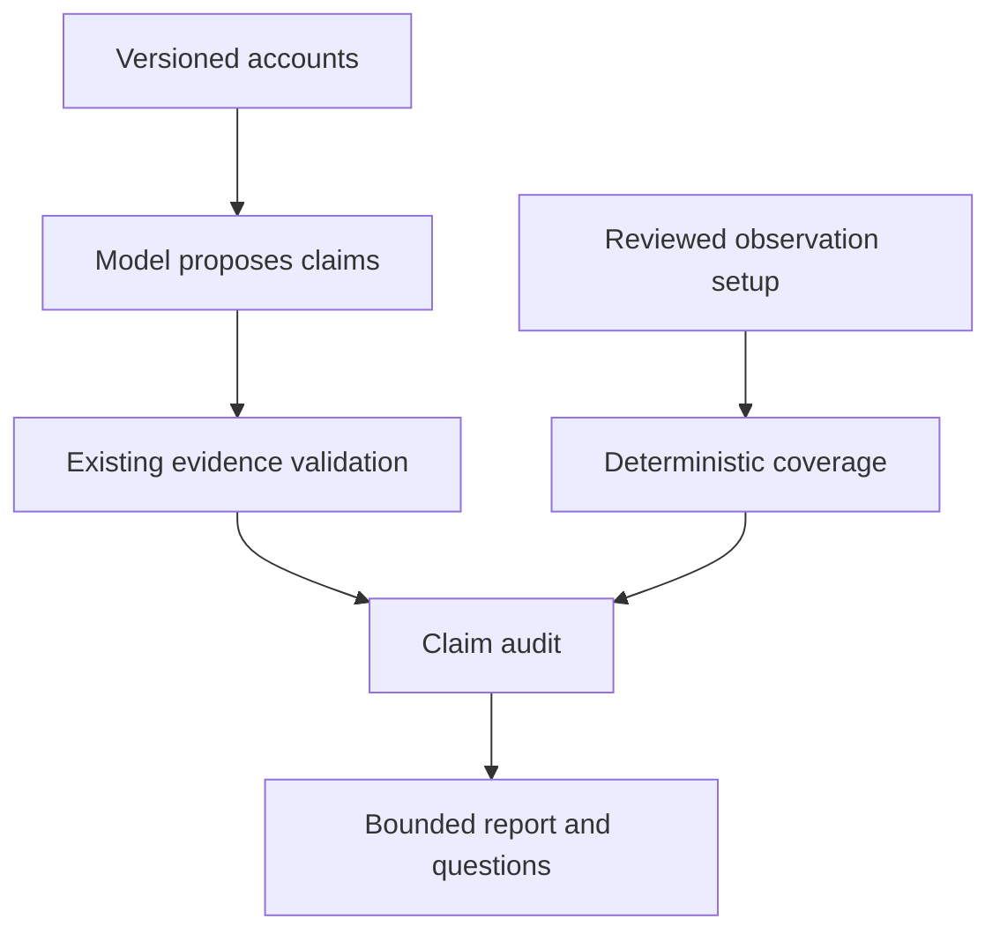

# Evidence Coverage Firewall

Care Notes does not only track evidence. It tracks whether evidence could have existed.

## Four different situations

- **Absence of evidence:** no account confirms an event. Occurrence remains unknown.
- **Evidence of absence:** a reviewed explicit negation, bounded to a source, subject, event class and time window, with direct continuous observation and meaningful silence. It still is not independent verification of reality.
- **Observation gap:** no reviewed capable direct source covers part of the window. An online watch is not medication observation.
- **Direct contradiction:** incompatible attributed accounts or reviewed assertions. Both remain visible; no majority vote or invented probability resolves them.

## Data and trust boundary

`dist/evidence-coverage.js` exports `validateCoverage`, `coverageFor`, `withCoverage`, `emptyCoverage` and `coverageFingerprint`. These are shared browser/Node modules. `coverage` is an optional version-1 sidecar on the existing version-1 ledger; old backups restore with no declared coverage. Old derived output is not evidence of coverage.

A profile contains `id`, `type`, `label`, `subject`, `capabilities`, `contractCapabilities`, `reviewed`, `mode` (direct/indirect), half-open `active` intervals, reasoned `unavailable` intervals, `blindSpots`, `cadenceSeconds` (or null), `heartbeats`, signed `clockOffsetSeconds`, nonnegative `clockUncertaintySeconds`, `reliability` (`level`, `basis`) and `silenceMeaningful`. Types and event-class strings are extensible. The extraction UI currently offers five broad topics; future adapters can use more precise event classes with the coverage API.

A binding links a profile to a particular original source ID/version. Changing or deleting any bound source withdraws that profile from the current audit until reviewed. `withCoverage` increments the revision. Narrative snapshots include the complete coverage configuration. Coverage corrections immediately recompute the audit and invalidate saved model narratives. Raw source versions, declared dependencies, quotation spans and relation withdrawal remain unchanged.

Capabilities require the intersection of declaration and reviewed contract. The provider receives text accounts only; it cannot set contracts, review flags, assertions, reliability or silence rules. The simple family form deliberately saves unknown reliability and non-evidentiary silence. Advanced adapters/imports can declare richer metadata through the validated schema. A reviewed flag is a human/adapter declaration, not a cryptographic device attestation: dishonest imports or incorrectly configured sensors cannot be detected from this data alone.

Reviewed assertions carry an ID, profile-scoped event ID, subject, event class, window, category and exact versioned source quotations. Duplicate event IDs from the same profile/category do not become independent events. They are not a confidence vote. An adapter must maintain stable event IDs and accurate capability contracts. No real adapter is shipped in this release.

## Coverage calculation

Convert explicit-offset timestamps to instants. Add the declared source-clock offset; shrink available ranges and expand unavailable ranges by the clock uncertainty. Intersect with the requested event window. If cadence is declared, each heartbeat supports at most the following cadence interval; no heartbeats means no continuous coverage. Subtract outages, removed wearables and other unavailable intervals. Only reviewed direct sources for the exact subject and event class can cover the requested event.

The map has four labels: zero elapsed coverage = unobserved; below half = poor; half to less than complete = partial; complete direct coverage without remaining spatial blind spots = well. Known spatial blind spots cap a fully timed observation at partial unless another capable source covers the full window without those blind spots. These thresholds describe coverage, never probabilities. Indirect signals remain visible with an explanation but cannot close a direct-observation gap.

The strongest negative boundary additionally requires meaningful silence, high declared reliability and no blind spots in the supporting source. Union coverage alone is insufficient: the source of the explicit denial must itself cover the claim window. Unknown time or subject cannot qualify.

## Claim audit and safe report

`auditEpisode(ledger, language)` runs after existing extraction validation. It produces an inspectable artifact with claim, support, opposing and unresolved evidence, coverage segments, blind spots, alternatives, maximum strength, final wording and status. Statuses are SUPPORTED, CONTESTED, UNDEROBSERVED and UNRESOLVED. SUPPORTED means an attributed account has declared support, not that a clinical fact was established.

All model-denied claims default to **not observed**, unless a matching human-reviewed explicit denial satisfies the stricter coverage rules with no contradictory, unresolved or unanalysed evidence. Non-observation stays unknown even under complete coverage; silence does not automatically generate an absence assertion. Positive assertions are reported as attributed source accounts. Broad-topic opposite claims with overlapping windows are conservatively flagged as potential conflicts, not proof that they describe the same occurrence.

The final Results report and text/PDF exports use deterministic attributed wording. Arbitrary generated paragraphs remain in the versioned backup for traceability but are quarantined from the final report. This intentionally changes 1.0.6's unconstrained prose presentation: validating a quotation does not prove entailment. No lexical blacklist is claimed to understand all negation. Missing extracted claims are shown as pending. An old report without current extraction does not become a verified report.

## Falsification, questions and alternatives

The falsification artifact contains inspectable evidence relationships and short reasons, never hidden model reasoning. Opposite polarity, retained contradiction relations, unknown dates, unavailable profiles and reviewed positive assertions are checked deterministically. Missing observations never contradict a positive observation by themselves.

Evidence debt uses an explicitly uncalibrated additive heuristic: importance 2 for medication topic, otherwise 1; uncertainty 3 for contested/unresolved, otherwise 2; reliability gap 1 unless high declared reliability; expected clarification 2 for a known window, otherwise 1. It asks at most three questions with the affected evidence IDs and visible score components. This is workflow prioritisation, not medical urgency or mathematical information gain.

Candidate timelines are bounded two-account alternatives for potential conflicts, each retaining source quotes, windows and unanswered questions. They are not exhaustive global histories and carry no probabilities. Compatible third-party events remain elsewhere in the report; a door opening does not identify who left.

## Locality, compatibility and limitations

No extra AI request is made for coverage or audit. BYOK providers and Android native transport remain unchanged. The same JS/CSS assets are bundled in Android and served on the web. APIs and private keys are not added to coverage backups. Backups restore sources and validate extraction first, validate optional coverage, then recompute audit; supplied derived audit artifacts are ignored.

English and Simplified Chinese cover the new experience. Other existing interface languages remain available; new coverage wording and its fictional fixture explicitly fall back to English. Original personal text is never translated automatically.

This is not passive sensing, diagnosis, episode prediction, medication-adherence verification, clinical validation or a replacement for clinicians. The core cannot prove the truth of source text, discover every omitted dependency, validate a sensor's physical field of view, or reliably infer event identity from ambiguous language. Real adapters, independent caregiver trials, live-model accuracy comparisons and wider physical Android testing remain future work.
